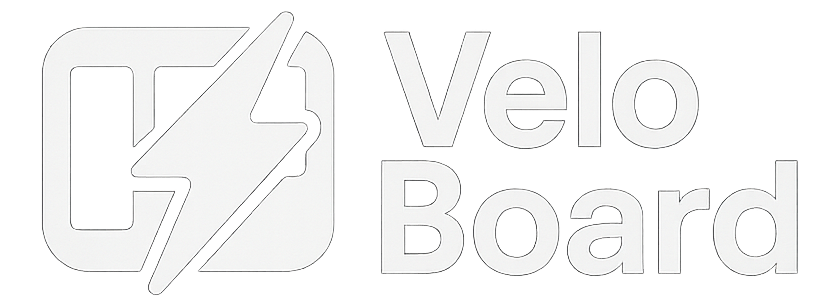
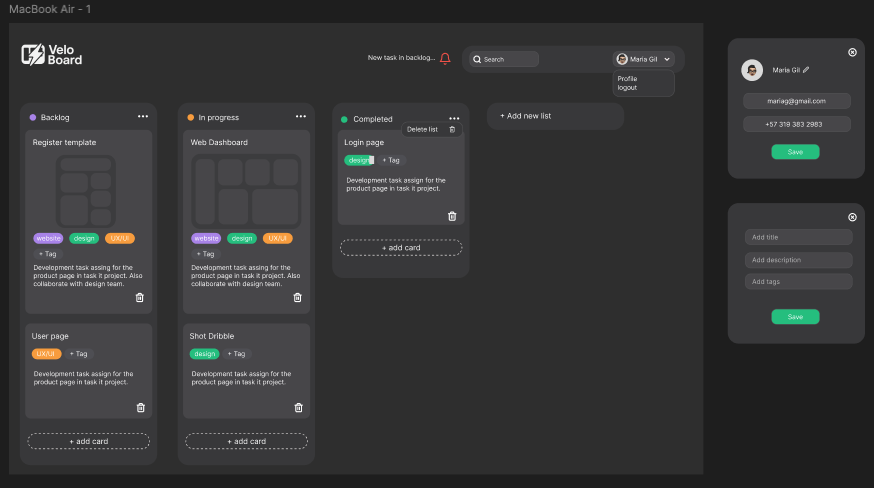

# VeloBoard



Gestiona proyectos y tareas de forma visual con esta aplicación Kanban en tiempo real. Su frontend en React.js ofrece una experiencia de usuario intuitiva con drag & drop, mientras que el backend en NestJS con WebSockets garantiza la colaboración fluida.

## Tabla de Contenidos

- [Primeros Pasos](#primeros-pasos)
- [Características](#características)
- [Diseño Figma](#diseño-figma)
- [Construcción](#construcción)
- [Contribuciones](#contribuciones)
- [Licencia](#licencia)
- [Autor](#autor)

## Primeros pasos

Crea un archivo .env en la raíz del proyecto y configura esta variable de entorno:
```
REACT_APP_URL_BACKEND = Debe apuntar al puerto donse se este corriendo el servicio del backend
```

Primero, Instalar dependencias:

```bash
yarn install
```

Segundo, ejecutar el development server:

```bash
npm run dev
# or
yarn dev
# or
pnpm dev
# or
bun dev
```

Open [http://localhost:3000](http://localhost:3000) with your browser to see the result.

## Características

La aplicación permite:

- Creación de Tableros: Los usuarios podrán crear nuevos tableros para organizar diferentes proyectos o flujos de trabajo.
- Columnas Personalizables: Dentro de cada tablero, los usuarios podrán crear, renombrar y eliminar columnas para representar las diferentes etapas del proceso (ej. "Por Hacer", "En Progreso", "Hecho").
- Creación de Tarjetas: Dentro de cada columna, los usuarios podrán crear tarjetas que representan tareas individuales. Cada tarjeta tendrá al menos un título y opcionalmente una descripción más detallada.
- Movimiento de Tarjetas (Drag & Drop): Los usuarios podrán arrastrar y soltar tarjetas entre diferentes columnas para cambiar su estado o prioridad.
- Reordenación de Tarjetas: Dentro de cada columna, los usuarios podrán arrastrar y soltar tarjetas para cambiar su orden de prioridad.

Con un diseño adaptable y enfocado en el rendimiento, VeloBoard utiliza estrategias avanzadas como Server Components y SSR para optimizar la experiencia del usuario, demostrando una sólida arquitectura y una cuidada organización del código.

## Diseño Figma



Puedes revisar el prototipo en el siguiente link: [Protitipo Figma](https://hoost.ru/ds/free/53474f9a/live/?macbook-air-1)

## Construcción

Este proyecto está construido utilizando las siguientes tecnologías y herramientas:

- **React 18**: Una biblioteca de JavaScript para construir interfaces de usuario.
- **Redux Toolkit**: Una biblioteca para el manejo de estado y caché de datos en React.
- **React Hook Form**: Una biblioteca de para el manejo de formularios
- **FormKit - Drag and Drop**: Una biblioteca para el manejo del drag and drop
- **SASS**: Preprocesador de CSS para un diseño rápido y eficiente.

### Estructura del proyecto

La estructura del proyecto es la siguiente:

```
/conexia-app
├── node_modules/       # Dependencias del proyecto
├── public/             # Archivos públicos
├── src/                # Código fuente del proyecto
├── postcss.config.js   # Configuración de PostCSS
├── package.json        # Archivo de configuración de npm
└── README.md           # Documentación del proyecto
```

## Contribuciones

Las contribuciones son bienvenidas. Por favor, sigue los siguientes pasos para contribuir:

1. Haz un fork del repositorio.
2. Crea una nueva rama (git checkout -b feature/nueva-funcionalidad).
3. Realiza tus cambios y haz commit (git commit -am 'Añadir nueva funcionalidad').
4. Haz push a la rama (git push origin feature/nueva-funcionalidad).
5. Abre un Pull Request.

## Licencia

Este proyecto está licenciado bajo la Licencia MIT.

## Autor

Proyecto desarrollado por:

[Untalinfo - GitHub](https://github.com/untalinfo)

[LinkedIn](https://www.linkedin.com/in/untalinfo/)

[email: racso1607@gmail.com](racso1607@gmail.com)
